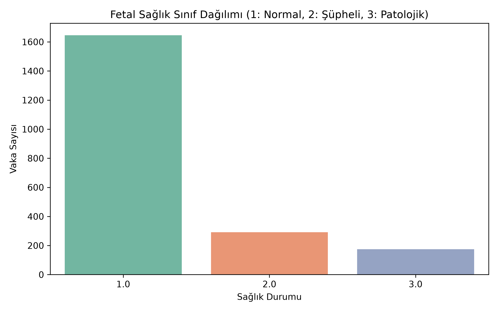
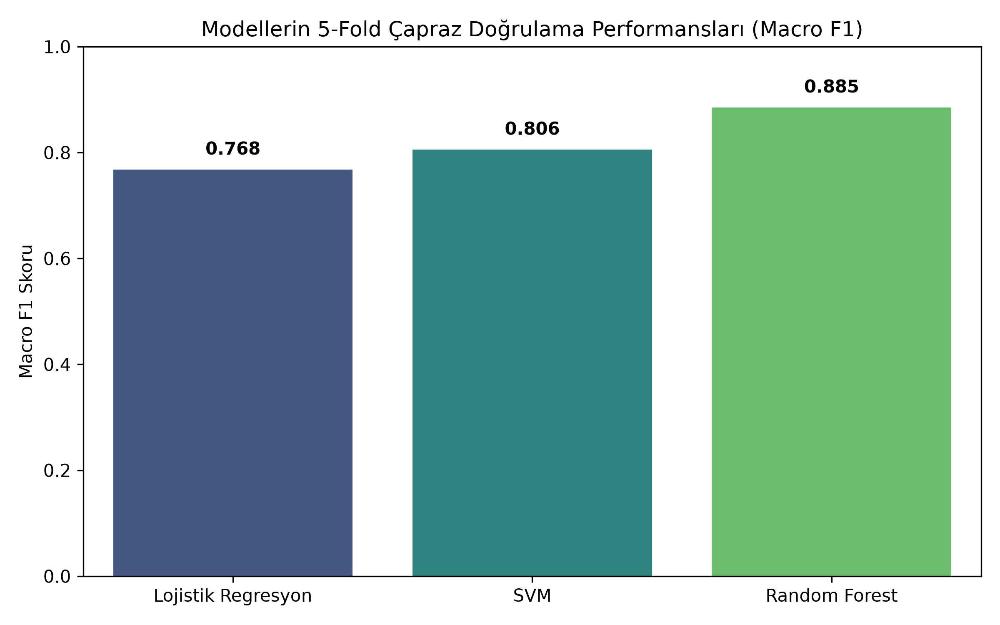
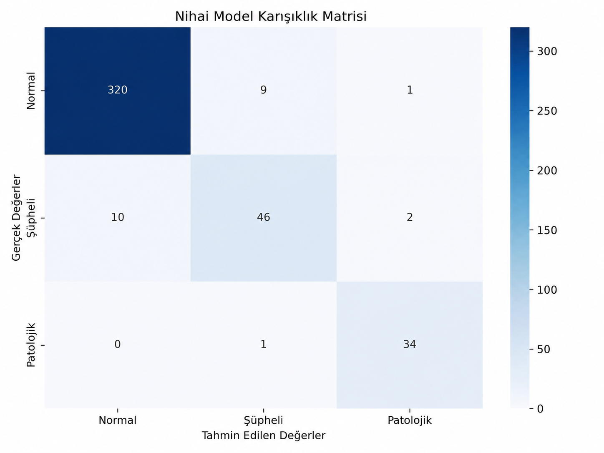
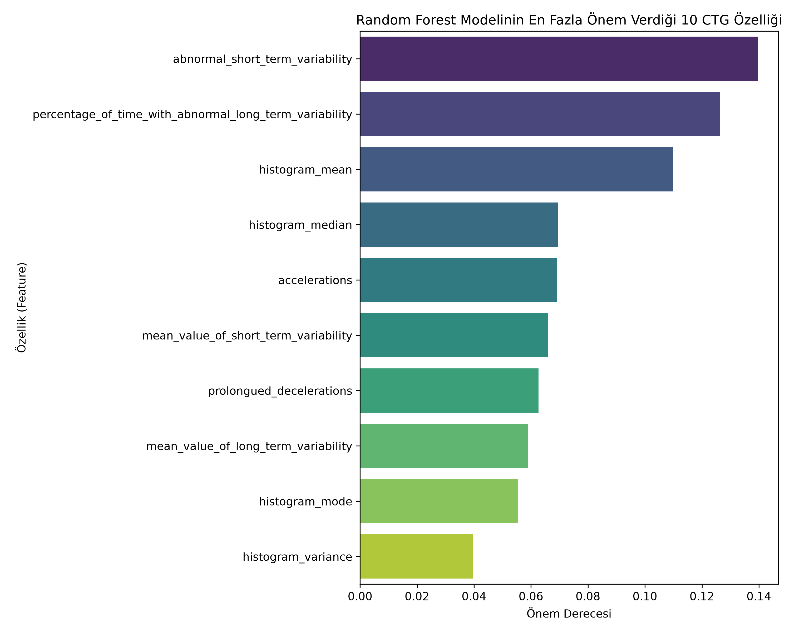

# Fetal Health Classification from CTG Features

This project was developed during a data science and machine learning bootcamp.

I used CTG-derived tabular features to compare three models for classifying fetal health as normal, suspect, or pathological.

## Dataset

The project uses the public Fetal Health Classification dataset from Kaggle.

It contains 2,126 records and 21 input features derived from CTG examinations.

Dataset:
https://www.kaggle.com/datasets/andrewmvd/fetal-health-classification

## What I did

- removed duplicate rows
- created a stratified 80/20 train-test split
- compared Logistic Regression, SVM, and Random Forest
- used 5-fold cross-validation with Macro F1
- kept scaling inside scikit-learn pipelines
- used class weighting for the imbalanced classes
- tuned the selected model with GridSearchCV
- evaluated the final model on the hold-out test set
- reviewed the confusion matrix and feature importance

## Results from my run

- Random Forest CV Macro F1: about **0.885**
- Hold-out accuracy: about **94.6%**
- Hold-out Macro F1: about **0.91**
- Pathological-class recall: about **97%**

These results belong to this specific dataset split and should not be treated as clinical validation.

## Visuals

### Class distribution



### Model comparison



### Confusion matrix



### Feature importance



## Run

```bash
python -m venv .venv
pip install -r requirements.txt
python fetal_health_classification.py
```

A longer Turkish write-up is available on Medium:

https://medium.com/@humanurozcelik555/ctg-verileriyle-fetal-sa%C4%9Fl%C4%B1k-s%C4%B1n%C4%B1fland%C4%B1rmas%C4%B1-%C3%BC%C3%A7-makine-%C3%B6%C4%9Frenmesi-modelinin-kar%C5%9F%C4%B1la%C5%9Ft%C4%B1r%C4%B1lmas%C4%B1-c5b962e5379a
